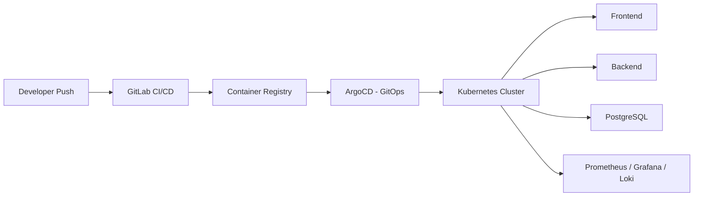

<h1 align="center">Hey, I'm Elvir 👋</h1>

<p align="center">
DevOps Engineer • RHCSA Certified • Kubernetes • Cloud & Infrastructure Automation
</p>

<p align="center">
Building production-style infrastructure with Linux, Kubernetes, Docker, Terraform, AWS/EKS, Ansible, GitOps, ArgoCD, Vault, and CI/CD.
</p>

---

# 👨‍💻 About Me

- 🌍 Based in Warsaw, Poland
- 🐧 RHCSA Certified Linux Administrator
- 🚀 DevOps Engineer passionate about automation, Kubernetes, and cloud-native technologies
- ☸️ Experienced building production-style Kubernetes environments in a home lab
- ⚙️ Skilled in Infrastructure as Code, GitOps, CI/CD, Linux administration, and infrastructure automation
- ☁️ Currently expanding my AWS and cloud architecture knowledge
- 📚 Continuously learning modern DevOps tools and best practices

---

# 🚀 Featured Project

## 🔹 Family App (LinatrixSite) – Production-Ready DevOps Platform

A full-stack Family Task Management application deployed on a self-managed **3-node Kubernetes cluster** (RHEL & Ubuntu), demonstrating a complete production-style DevOps workflow: containerization, Helm packaging, automated CI/CD, GitOps deployment, secrets management, and full observability.

### Architecture



### Technologies

- Linux (RHEL & Ubuntu)
- Docker
- Kubernetes (kubeadm, Calico CNI)
- NGINX Ingress
- Helm
- GitLab CI/CD
- ArgoCD (GitOps)
- HashiCorp Vault
- Prometheus & Grafana
- Loki (log aggregation)
- PostgreSQL
- Node.js / Express

### Highlights

- Built a GitLab CI/CD pipeline: automated image builds, registry pushes, and Helm value updates on every push to `main`
- Implemented GitOps with ArgoCD — the cluster's live state is continuously reconciled against Git, with zero manual `kubectl apply`
- Integrated HashiCorp Vault for centralized secrets management, migrating all secrets out of plaintext Git history
- Deployed Prometheus, Grafana, and Loki for full metrics + log observability
- Configured NGINX Ingress for unified routing to frontend and backend services
- Implemented Horizontal Pod Autoscaling, verified with a real synthetic load test (1 → 2 replicas, live)
- Built and executed a full disaster recovery drill: simulated total namespace loss, automatic GitOps rebuild via ArgoCD, and data restore from an S3-backed PostgreSQL backup — verified end-to-end
- Provisioned a parallel AWS EKS cluster using Terraform (VPC, IAM, managed node group, remote state in S3 + DynamoDB), including resolving a real IAM/IRSA storage-provisioning issue

🔗 Repository (GitLab, primary): https://gitlab.com/elvir.osmanov.1989/linatrixsite
🔗 Repository (GitHub mirror): https://github.com/elvirosmanov1989-alt/linatrixsite

🌐 App (public demo): https://linatrixsite.site *(hosted via Firebase/Cloudflare — separate from the Kubernetes infrastructure above)*


---

## 🚀 Other Projects

| Project | Description |
|---------|-------------|
| **DevOps Portfolio** | Personal GitHub profile and portfolio showcasing DevOps projects and technologies. |
| **GitLab CI/CD Assignment** | Automated CI/CD pipelines using GitLab CI for building, testing, and deployment. |
| **Multi-Service Web Application** | Dockerized React, Node.js, and PostgreSQL application serving as the foundation for Kubernetes deployment. |
| **Kubernetes Multi-Tier Deployment** | Kubernetes manifests for deploying a multi-tier application with networking, storage, and service discovery. |
| **Ansible Multi-Tier Project** | Infrastructure automation and configuration management using Ansible roles and playbooks. |
| **Vault HA Cluster** | High-availability HashiCorp Vault deployment on Kubernetes for secure secrets management. |

---

# 🛠️ Tech Stack

### Operating Systems


### Containers & Orchestration


### Infrastructure as Code & Automation


### GitOps & CI/CD


### Monitoring & Logging


### Databases


### Version Control


### Cloud


---

# 🏆 Certifications

- ✅ RHCSA (Red Hat Certified System Administrator)

---

## 📊 GitHub Statistics

<p align="center">
  
</p>

<p align="center">
  
</p>

<p align="center">
  
</p>

---

# 🎯 Current Focus

✅ Linux Administration

✅ Docker

✅ Kubernetes

✅ Helm

✅ GitLab CI/CD

✅ GitOps with ArgoCD

✅ Infrastructure as Code

✅ Ansible

✅ Terraform

✅ HashiCorp Vault

✅ Monitoring & Logging

🔄 AWS Cloud

🔄 Amazon EKS

🔄 Terraform on AWS

🔄 Cloud Infrastructure Architecture

---
# ✅ Recently Completed

- 🔐 Kubernetes Security & RBAC (least-privilege service accounts, Vault-integrated secrets)
- 📊 Kubernetes Scaling (HPA, load-tested)
- 💾 Backup & Disaster Recovery (Velero + PostgreSQL backups, full DR drill verified)
- ☁️ AWS Migration with Terraform
- 🚀 Amazon EKS (provisioned, deployed to, and safely torn down)
# 📈 Currently Working On

- 🔐 Kubernetes Security & RBAC
- ☁️ AWS Migration with Terraform
- 🚀 Amazon EKS
- 📊 Kubernetes Scaling
- 💾 Backup & Disaster Recovery
```
